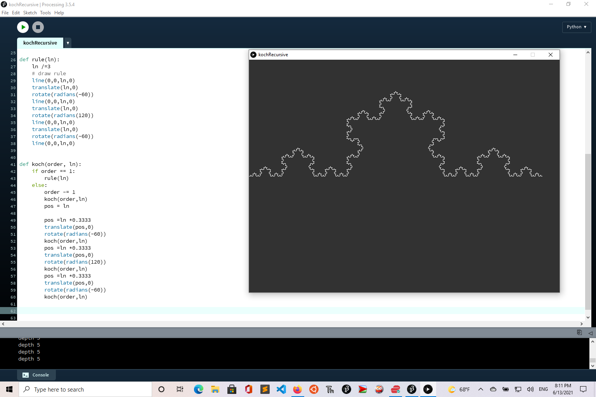

# koch-recursive
koch curve in processing, not using lsystems or arrays 

see it working in the browser from the P5.js version

https://github.com/greggelong/koch-recursiveJs



```processing
 # finally got the koch curve to work without lsystems
# using recursion
# 

def setup():
    size(800,600)
    background(50)
    stroke(255)
    translate(0,300)  # make this the origin
    depth = 5
    # caculate lenth so it fits on the canvas depth 5 is 10 pixles
    ruleLenght = 10*(3**(5-depth)) 
    koch(depth,ruleLenght)  # koch(depth of recursion, len of first rule
    
def draw():
    background(50);
    translate(0,300)  # make this the origin
    depth = floor(map(mouseX,0, width,1,6))
    println("depth "+str(depth))
    #depth = 5
    # caculate lenth so it fits on the canvas depth 5 is 10 pixles
    ruleLenght = 10*(3**(5-depth)) 
    koch(depth,ruleLenght)  
 
        
def rule(ln):
    ln /=3
    # draw rule
    line(0,0,ln,0)
    translate(ln,0)
    rotate(radians(-60))
    line(0,0,ln,0)
    translate(ln,0)
    rotate(radians(120))
    line(0,0,ln,0)
    translate(ln,0)
    rotate(radians(-60))
    line(0,0,ln,0)
    
   
def koch(order, ln):
    if order == 1:
        rule(ln)
    else:
        order -= 1
        koch(order,ln)
        pos = ln
        
        pos =ln *0.3333
        translate(pos,0)
        rotate(radians(-60))
        koch(order,ln)
        pos =ln *0.3333
        translate(pos,0)
        rotate(radians(120))
        koch(order,ln)
        pos =ln *0.3333
        translate(pos,0)
        rotate(radians(-60))
        koch(order,ln)
        

```
